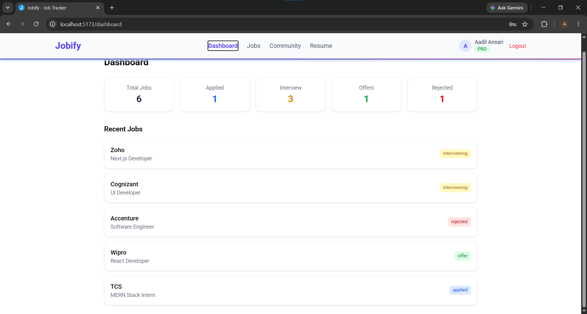
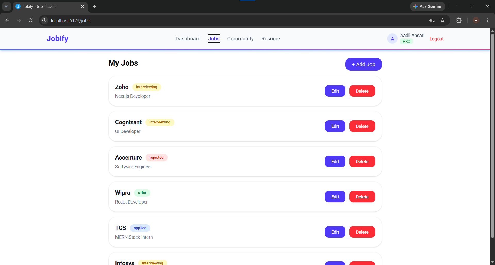
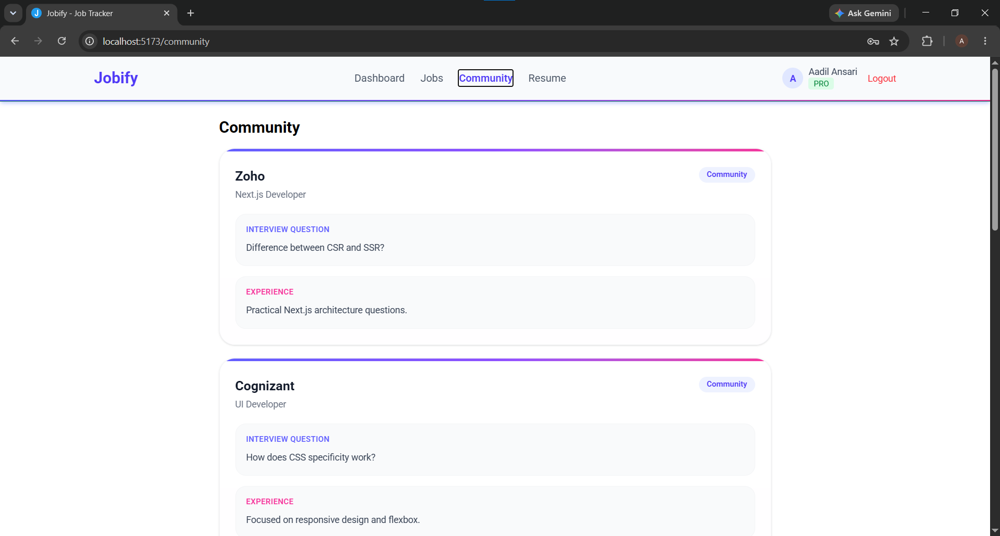
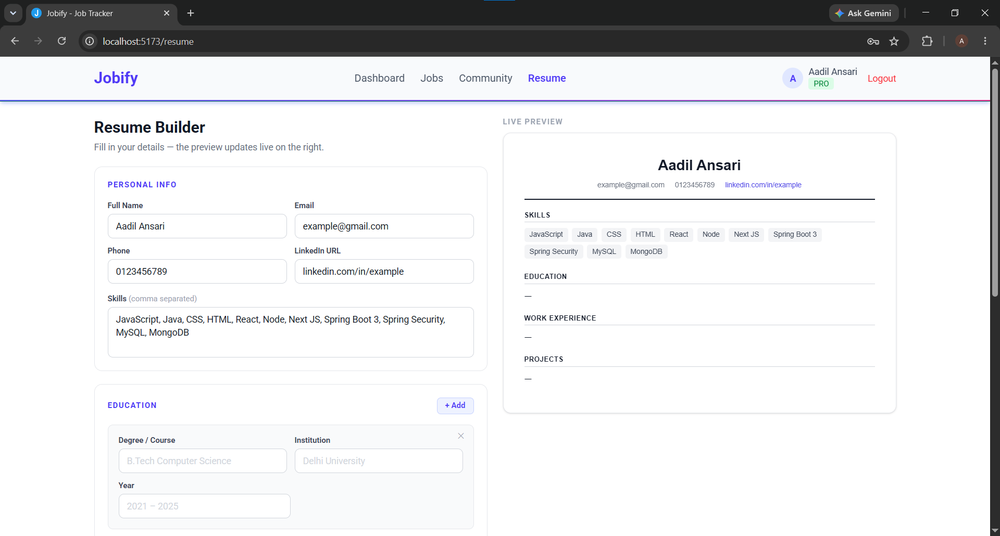
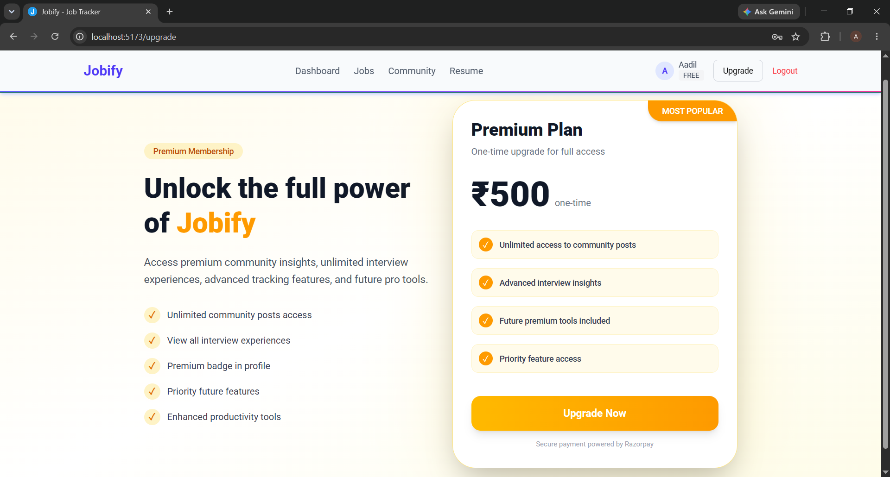

# Jobify - Job Tracker Web Application

A full-stack web application that helps users manage their job search process in one place. Users can track applications, build resumes, explore interview experiences shared by others, and access premium content through a subscription model.

## Screenshot







---

## Features

### Job Tracking

- Add, edit, and delete job applications
- Track status (Applied, Interview, Selected, Rejected)
- Search and filter applications

### Resume Builder

- Create a basic resume using a form
- Download resume as PDF

### Community Section

- Share interview questions and experiences
- Explore posts from other users
- Filter by company and role

### Subscription System

- Free vs Premium access
- Limited content for free users
- Demo payment integration for upgrading

### Browser Extension (Demo)

- Extract job details from a webpage
- Save directly into the application

---

## Tech Stack

- **Frontend:** React
- **Backend:** Node.js + Express
- **Database:** MySQL
- **Authentication:** JWT
- **State Management:** Redux Toolkit
- **Payment:** Razorpay (Test Mode)

---

## Project Structure

```bash
job-tracker/
│
├── frontend/        # React app
├── backend/         # Node + Express API
├── docs/            # Project documentation
├── README.md
```

- Read this: https://github.com/Galaxy169/Jobify/blob/main/docs/jobify-folder-structure.md

---
